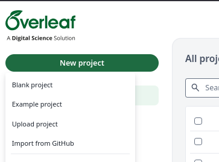
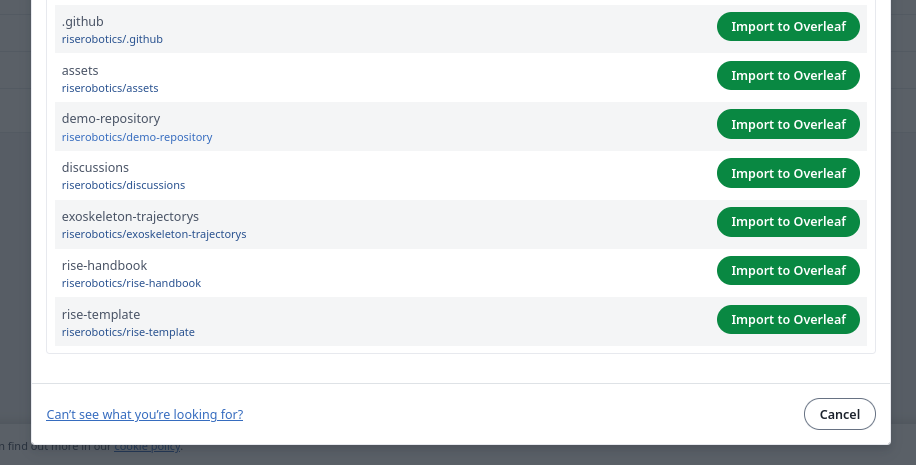
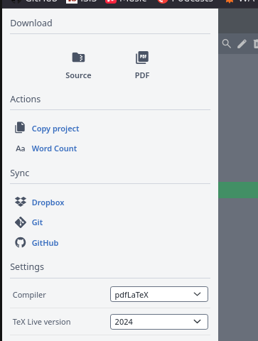

# The RISE Handbook
This repository contains the LaTeX files that make up the source for the RISE Handbook. Inside of this book you can find syllabus type information, on how grading works, what we expect and how the semester is structured. 

In this document we offer some guidance for setting the project up using [Overleaf](https://www.overleaf.com/project), and committing to it, for use within the ISIS Moodle platform at TU Berlin. 

## Setting up the project on Overleaf

1. Log into your Overleaf Account. Overleaf is a platform for online collaboration and editing on LaTeX Documents, if you are affiliated with TU Berlin, you will have access to the premium feature set. This is required for syncing with Git, something we have to do in this case. 

You may access Overleaf using [this](https://www.overleaf.com/project) link. When logging in **make sure to use the Single-Sign-On button**, and your TU Berlin E-Mail address.

2. Open the project inside Overleaf. To do so, click the Button "New Project" in the top left hand corner. Select "Import from Github".

3. WHen using Overleaf for the first time in conjunction with GitHub, you will now have to connect your GitHub Account with Overleaf. After completion, you should be able to see all sorts of Repositorys that you can select from. Select the `rise-handbook` repository.

4. YOu can now see the content of the repository as a project in your Overleaf account. Whenever you want to edit the project, you'll have to include one additional step. To make sure that your are editing the current state of the project, "Sync" (i.e. pull) the project before editing. To do so, click the top left hand corner button "Menu", and click on GitHub, under Sync.

Depending on the state of the project, you may have to click "Pull Overleaf changes from GitHub". If there are no remote changes, i.e. the button does not show up, you may go ahead with editing.

5. After you are finished editing, make sure to do the same, click the "Menu" button in the top left hand corner and sync with Github. THis time, use "Push Overleaf changes to GitHub". In case, there has been an edit to the remote repository while you were making a change in Overleaf, Pull first, and then use Push later.
